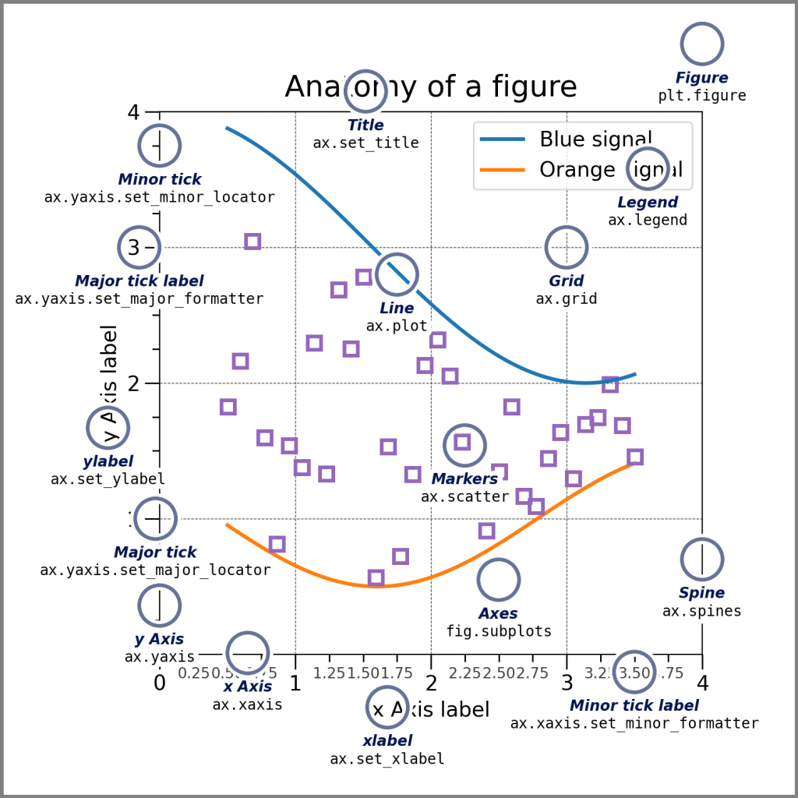

## Estructura de un esquema de gráficos con Matplotlib



<a href="https://arxiv.org/abs/2210.07278" target="_blank">arXiv Preprint</a> | <a href="https://github.com/marvinschmitt/MetaUncertaintyPaper" target="_blank">Code</a><br>

# Introducción

El presente es un Jupyter Notebook que demuestra gráficos utilizando la gramática de gráficos con Python, iniciaremos con la librería **Matplotlib**

## Operaciones básicas

```{python}
#| echo: false
import os

# Cambia el directorio de trabajo
os.chdir("D:/DATA_SCIENCE_ENDI/NOTEBOOKS_R/MULTIVARIANTE/MARCELO_WEBSITE/docs/projects/")

```


```{python}
import pandas as pd

df_ipc = pd.read_excel("IPC/SERIE HISTORICA IPC_05_2025.xls",
                        sheet_name="1. ÍNDICE",
                        skiprows=4,
                        engine="xlrd",
                        nrows=57)
display(df_ipc)
print("TIPO DE VARIABLES:")
df_ipc.dtypes
```

----


