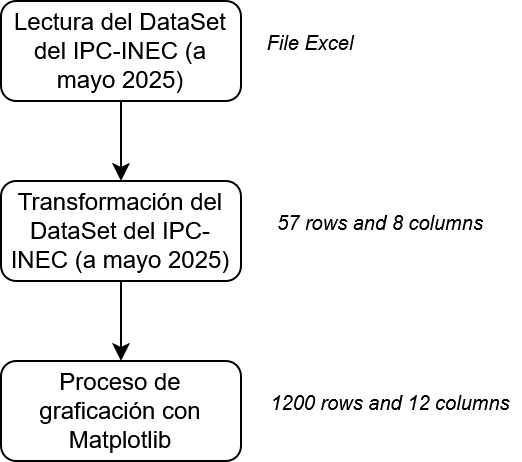

## Estructura de un esquema de gráficos con Matplotlib




<a href="https://arxiv.org/abs/2210.07278" target="_blank">arXiv Preprint</a> | <a href="https://github.com/marvinschmitt/MetaUncertaintyPaper" target="_blank">Code</a><br>

# Introducción

El presente es un Jupyter Notebook que demuestra gráficos utilizando la gramática de gráficos con Python, iniciaremos con la librería **Matplotlib**

## Operaciones básicas

```{python}
#| echo: false
import os

# Cambia el directorio de trabajo
os.chdir("D:/DATA_SCIENCE_ENDI/NOTEBOOKS_R/MULTIVARIANTE/MARCELO_WEBSITE/projects/")

```

```{python}
import pandas as pd

df_ipc = pd.read_excel("IPC/SERIE HISTORICA IPC_05_2025.xls",
                        sheet_name="1. ÍNDICE",
                        skiprows=4,
                        engine="xlrd")

# Find the first row where all cells are empty (NaN)
fila_vacia = df_ipc[df_ipc.isnull().all(axis=1)].index

# If an empty row is found, trim the DataFrame up to that row
if not fila_vacia.empty:
    df_ipc = df_ipc.iloc[:fila_vacia[0]]

# List with the correct names of the columns
nuevos_nombres = ["AÑO",
                  "ENERO", 
                  "FEBRERO",
                  "MARZO",
                  "ABRIL",
                  "MAYO",
                  "JUNIO",
                  "JULIO",
                  "AGOSTO", 
                  "SEPTIEMBRE", 
                  "OCTUBRE",
                  "NOVIEMBRE",
                  "DICIEMBRE"]

# Assign the new names to the DataFrame
df_ipc.columns = nuevos_nombres

# Asignar los nuevos nombres al DataFrame
df_ipc.columns = nuevos_nombres
display(df_ipc.dtypes)
display(df_ipc.shape)
display(df_ipc.describe(include="all"))
```

En Ecuador, la inflación se calcula a partir del **Índice de Precios al Consumidor (IPC)**, que es publicado mensualmente por el **Instituto Nacional de Estadística y Censos (INEC)**. El IPC es un indicador que mide la evolución promedio de los precios de una canasta representativa de bienes y servicios que consume la población (INEC, 2024). La inflación, a su vez, representa el cambio porcentual en el nivel general de precios de dichos bienes y servicios en un período determinado (Mishkin, 2015).

### Fórmulas básicas para calcular la inflación a partir del IPC

1. **Inflación mensual**  
Mide cuánto han subido o bajado los precios de un mes respecto al mes anterior, expresado en porcentaje:

$$
\text{Inflación mensual (\%)} = \left( \frac{\text{IPC actual} - \text{IPC mes anterior}}{\text{IPC mes anterior}} \right) \times 100
$$

2. **Inflación acumulada en el año** (de enero al mes actual)  
Refleja el cambio porcentual acumulado desde el inicio del año hasta el mes actual:

$$
\text{Inflación acumulada (\%)} = \left( \frac{\text{IPC mes actual} - \text{IPC enero}}{\text{IPC enero}} \right) \times 100
$$

3. **Inflación anual (interanual)**  
Mide la variación porcentual en los precios respecto al mismo mes del año anterior:

$$
\text{Inflación anual (\%)} = \left( \frac{\text{IPC mes actual} - \text{IPC mismo mes año anterior}}{\text{IPC mismo mes año anterior}} \right) \times 100
$$

### Ejemplo con datos ficticios

Supongamos los siguientes valores de IPC:

- Junio 2024: 105.2  
- Mayo 2024: 104.8  
- Enero 2024: 102.0  
- Junio 2023: 103.1  

Cálculos:

- **Inflación mensual (junio vs mayo):**  
$$
\frac{105.2 - 104.8}{104.8} \times 100 = 0.38\%
$$

- **Inflación acumulada (enero a junio 2024):**  
$$
\frac{105.2 - 102.0}{102.0} \times 100 = 3.14\%
$$

- **Inflación anual (junio 2024 vs junio 2023):**  
$$
\frac{105.2 - 103.1}{103.1} \times 100 = 2.04\%
$$

---

### Notas adicionales

- El IPC base en Ecuador actualmente corresponde a diciembre de 2014 = 100, producto de un cambio metodológico para mejorar la representatividad del índice (INEC, 2023).  
- La inflación puede calcularse para el total nacional, así como para regiones o grupos específicos de gasto, tales como alimentos, transporte o vivienda (INEC, 2024).  
- El cálculo se realiza usando los valores del IPC con decimales para mantener precisión (Mishkin, 2015).

---

### Referencias

Instituto Nacional de Estadística y Censos. (2023). *Metodología del Índice de Precios al Consumidor*. https://www.ecuadorencifras.gob.ec/documentos/web-inec/IPC/Metodologia_IPC.pdf

Instituto Nacional de Estadística y Censos. (2024). *Informe mensual del Índice de Precios al Consumidor*. https://www.ecuadorencifras.gob.ec/ipc

Mishkin, F. S. (2015). *The Economics of Money, Banking and Financial Markets* (10th ed.). Pearson.

---

```{python}
# =============================================================================
# Calculation of IPC
# =============================================================================

# Filter of DataFrame IPC desde el año base 2014=100
df_ipc = df_ipc.loc[df_ipc['AÑO'] >= 2014].reset_index(drop=True)

# Ordered list of months
meses = ["ENERO", 
         "FEBRERO",
         "MARZO",
         "ABRIL", 
         "MAYO", 
         "JUNIO",
         "JULIO", 
         "AGOSTO", 
         "SEPTIEMBRE",
         "OCTUBRE",
         "NOVIEMBRE",
         "DICIEMBRE"]

# Create new DataFrame for monthly inflation
df_inflacion = df_ipc[["AÑO"]].copy()

# Base year (2014) equal to 100
df_inflacion.loc[0, meses] = 1

# Calculate monthly inflation for the following years
for i in range(1, len(df_ipc)):
    for j, mes in enumerate(meses):
        valor_actual = df_ipc.loc[i, mes]

        # Skip if None or NaN (case of 2025 from June)
        if pd.isna(valor_actual):
            continue

        if j == 0:
            # JANUARY: use DECEMBER of the preceding year
            valor_anterior = df_ipc.loc[i-1, "DICIEMBRE"]
        else:
            # Rest of months: use the previous month of the same year.
            valor_anterior = df_ipc.loc[i, meses[j-1]]

        # Avoid calculation if previous value is None or NaN
        if pd.isna(valor_anterior):
            continue

        inflacion = ((valor_actual - valor_anterior) / valor_actual) * 100
        df_inflacion.loc[i, mes] = round(inflacion, 2)

display(df_inflacion)
```

----

## Apps en Shiny:

### **ENEMDU**

<div style="text-align: center;">
  <iframe 
    src="https://marcelo-chavez.shinyapps.io/ENEMDU_VISOR/" 
    width="800" 
    height="400" 
    style="border: none;">
  </iframe>
</div>

### Gráfico de la Inflación desde el 2014 al 2025 en todos los meses de enero con fines comparativos:

```{python}
import plotly.express as px

def graficar_inflacion_mensual_plotly(df, mes):
    if mes not in df.columns:
        raise ValueError(f"'{mes}' no es una columna válida en el DataFrame.")
    
    df = df.copy()
    df["AÑO"] = df["AÑO"].astype(int)
    df = df.sort_values(by='AÑO')

    # Crear columna categórica para color
    df['signo'] = df[mes].apply(lambda x: 'Negativo' if x < 0 else 'Positivo')

    # Colores para categorías
    color_map = {'Positivo': '#ff6347', 'Negativo': '#77dd77'}

    # Crear columna para texto en formato porcentaje
    df['texto'] = df[mes].apply(lambda x: f"{x:.2f}%")

    # Crear gráfico pasando el texto directamente
    fig = px.bar(
        df,
        x='AÑO',
        y=mes,
        color='signo',
        color_discrete_map=color_map,
        text='texto',  # <--- texto pasa aquí directamente
        labels={mes: 'Inflación (%)', 'AÑO': 'Año'},
        title=f"Comparativo de la Inflación Mensual - {mes.capitalize()} (2014-2025)"
    )

    # Ajustar posición del texto: afuera para positivos, adentro para negativos
    fig.update_traces(
        textposition=df['signo'].apply(lambda x: 'outside' if x == 'Positivo' else 'inside'),
        marker_line_color='black',
        marker_line_width=0.5
    )

    # Eje Y con ticks cada 0.1, rango -2 a 2
    fig.update_yaxes(
        tickvals=[round(i * 0.1, 2) for i in range(-20, 21)],
        title_text="Inflación (%)"
    )

    # Eje X con todos los años visibles
    fig.update_xaxes(
        tickvals=df["AÑO"].tolist(),
        tickangle=90,
        title_text="Año"
    )

    # Layout general
    fig.update_layout(
        xaxis_tickangle=90,
        yaxis_title="Inflación",
        xaxis_title="Año",
        uniformtext_minsize=6,
        uniformtext_mode='hide',
        plot_bgcolor='white',
        legend_title_text='',
        margin=dict(t=50, b=80)
    )

    # Línea horizontal en 0
    fig.add_hline(y=0, line_color='black', line_width=1)

    fig.show()
graficar_inflacion_mensual_plotly(df_inflacion, "ENERO")
```


